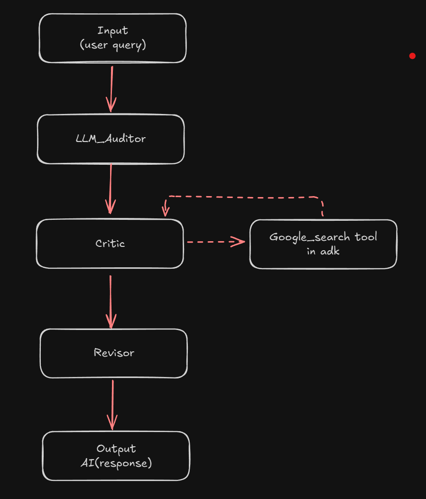

# Fact Checker

A sophisticated AI agent that evaluates LLM-generated answers, verifies actual accuracy using web search, and refines responses to ensure alignment with real-world knowledge.

## 🔍 Overview

The Fact Checker is an intelligent system designed to validate and improve the accuracy of AI-generated responses. It uses a multi-agent architecture to critically analyze answers and provide fact-checked, reliable information.

## 🌊 Workflow



The Fact Checker follows a sequential process:

1. **Input**: User provides a query or statement to fact-check
2. **Fact Checker**: Main coordinator agent receives the input
3. **Critic**: Analyzes the input and identifies potential inaccuracies
   - Uses Google Search tool in ADK to verify facts against real-world data
   - Evaluates claims and identifies areas that need verification
4. **Revisor**: Refines and corrects the response based on critic's findings
   - Incorporates verified information
   - Ensures accuracy and completeness
5. **Output**: Delivers a fact-checked, accurate AI response

## 🚀 Features

- **Multi-Agent Architecture**: Sequential workflow with specialized critic and revisor agents
- **Real-time Fact Verification**: Uses Google Search integration to verify claims
- **Intelligent Analysis**: Critically evaluates LLM responses for accuracy
- **Response Refinement**: Improves and corrects inaccurate information
- **Extensible Design**: Built on Google ADK framework for easy customization

## 📦 Installation

### Prerequisites

- Python 3.10 or higher
- Google Cloud credentials (for ADK and search functionality)

### Setup

1. Clone the repository:
```bash
git clone <https://github.com/Shreyas-Walde/adk-fact-checker.git>
cd llm-auditor
```

2. Install dependencies using uv (recommended):
```bash
uv sync

3. Set up environment variables:
```bash
cp .env.example .env
# Edit .env with your Google Cloud credentials
```

## 🏃‍♂️ Quick Start

### Basic Usage

```python
from fact_checker.agent import root_agent
from google.adk.runners import InMemoryRunner
from google.genai.types import Part, UserContent

# Create runner
runner = InMemoryRunner(agent=root_agent)

# Create session
session = runner.session_service.create_session(
    app_name=runner.app_name, 
    user_id="test_user"
)


### Command Line Usage

```bash
# Run the main script
uv run python main.py

# Test with the provided example
uv run python access-through.py
```

## 🏗️ Architecture

### Components

- **Root Agent (`fact_checker`)**: Main coordinator
- **Critic Agent**: Analyzes and validates information
- **Revisor Agent**: Refines and corrects responses
- **Google Search Integration**: Real-time fact verification

### Sub-Agents

```
fact_checker/
├── agent.py              # Main fact checker agent
├── sub_agents/
│   ├── critic/
│   │   ├── agent.py      # Critic agent implementation
│   │   └── prompt.py     # Critic prompts and instructions
│   └── reviser/
│       ├── agent.py      # Revisor agent implementation
│       └── prompt.py     # Revisor prompts and instructions
```

## 🔧 Configuration

### Environment Variables

Create a `.env` file with:

```env
GOOGLE_CLOUD_PROJECT=your-project-id
GOOGLE_CLOUD_LOCATION=your-location
GOOGLE_CLOUD_STORAGE_BUCKET=your-bucket
GOOGLE_APPLICATION_CREDENTIALS=path/to/credentials.json
```

### Development Dependencies

Install development dependencies:

```bash
uv sync --group dev
```

## 📝 Examples

### Example 1: Scientific Fact Checking

```python
query = "Double check this: Water boils at 100°F at sea level."
# Output: Corrected information about water boiling at 100°C (212°F)
```

### Example 2: Historical Fact Verification

```python
query = "Verify: The Great Wall of China was built in the 15th century."
# Output: Corrected timeline spanning multiple dynasties
```

## 🤝 Contributing

1. Fork the repository
2. Create a feature branch
3. Make your changes
4. Add tests for new functionality
5. Run the test suite
6. Submit a pull request


## 🙋‍♀️ Support

For questions and support, please open an issue in the repository.

---

**Built with ❤️ using Google ADK and modern Python tooling**